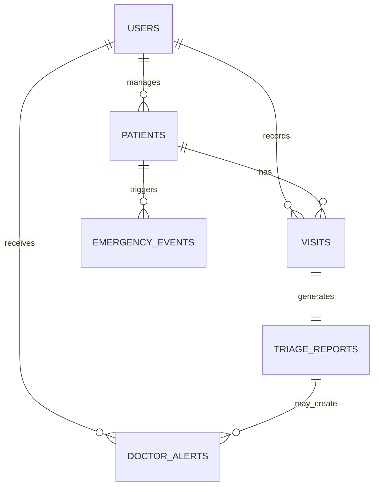
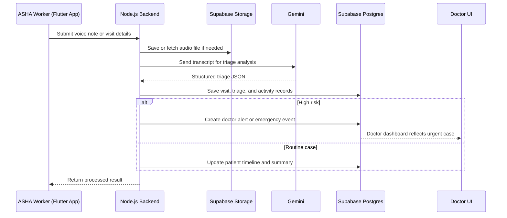
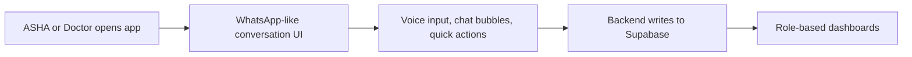

# System Diagrams

## 1. Core Data Model

## 2. Voice Workflow

## 3. Familiar Chat-Style UI

## Notes

- The current product does not depend on WhatsApp integration.
- The UI borrows familiar chat patterns so users feel comfortable.
- Gemini is the active AI layer for triage and chat behavior.
- Supabase is the active source of truth for auth, data, and storage.
